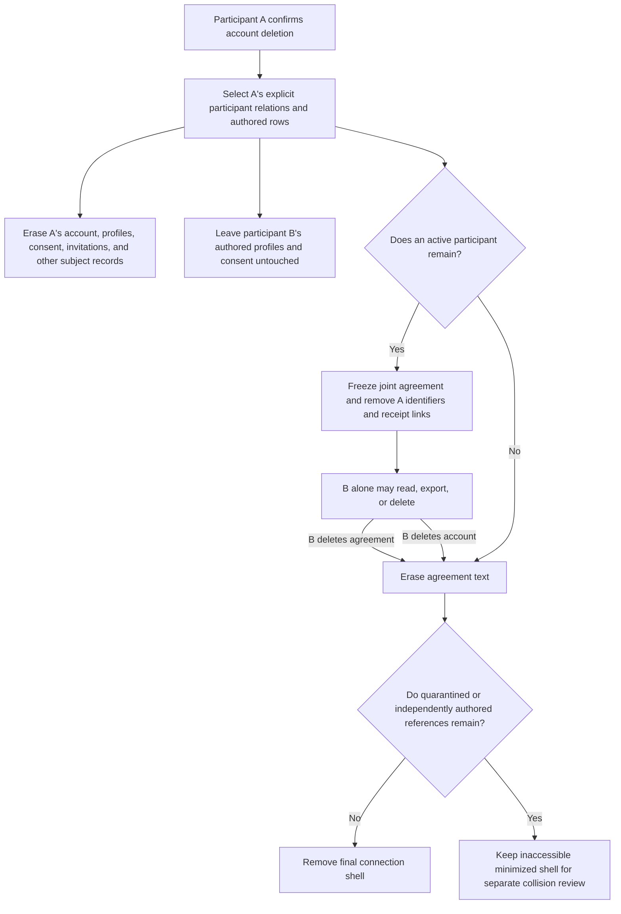

# Stage 4.3-D Ownership, Visibility, Export, Deletion, and Retention Specification

Status: **APPROVED PRODUCT SPECIFICATION — OPTION C SELECTED; IMPLEMENTATION NOT BUILT**

Prepared: 2026-09-11

Branch: `feature/seed-mvp`

Delivery issue: [#12](https://github.com/Esteve32/GreenElephantorg/issues/12)

Authority: DEC-041 in `docs/DECISION_LOG.md`

This document is a recovery checkpoint and implementation contract. Estève
selected Option C on 2026-09-11 so the surviving participant retains restricted
custody of a frozen joint agreement. `docs/DECISION_LOG.md` remains the canonical
approval record. This product choice authorizes branch implementation and
disposable-fixture proof, but it is not a legal conclusion and does not authorize
production activation or migration before the legal/privacy gate below is met.

## Approved decision boundary

DEC-041 already approves these boundaries:

- independently authored private and profile data belongs to its author;
- slot ownership is not blanket authority over records beneath the slot;
- a joint agreement is a distinct shared record;
- account deletion immediately revokes participation and locks or hides the
  joint agreement;
- export includes the subject's authored data plus an approved view of owned
  and linked relationship metadata, without another person's private payloads;
- unaccepted invitations and provisional nickname/relation data expire after
  30 days.

The earlier baseline left one material choice open: what happens to a locked
joint agreement after one participant deletes their account. Estève resolved it
by selecting Option C. The surviving participant may read, export, and delete the
frozen agreement until they delete it or their account, whichever occurs first.
The deleted participant loses access immediately. This policy remains subject to
the production legal/privacy gate in this specification.

## Classification vocabulary

- **Author-owned:** content created by one verified account. Only that author can
  read, export, update, or erase its payload.
- **Subject-owned:** account or entitlement data about one person. The subject
  can export it; deletion removes or de-identifies it according to its purpose.
- **Participant metadata:** the minimum relationship state needed by every
  linked participant. Each active participant can see an appropriately minimized
  view, but no participant owns every related record.
- **Joint shared record:** content that becomes shared only through current,
  independently attributable participation and consent from both accounts.
- **Operational evidence:** minimized authorization or lifecycle facts with no
  private/free-text payload. Access is service-only unless a subject-export rule
  below explicitly includes it.
- **Local-only:** content held in the browser vault. The server cannot read,
  export, or delete it; the browser performs those actions after an explicit
  local confirmation.
- **Historical quarantine:** a preserved legacy row whose current authorship or
  privacy basis cannot be proven. It is not silently reclassified, surfaced, or
  used to authorize current behavior.

## Field-level matrix

| Record / field | Classification and authority | Runtime visibility | Subject export | Account deletion | Retention rule |
| :--- | :--- | :--- | :--- | :--- | :--- |
| Browser-vault private check-in: octant, reflection, timestamp | Local-only; the confirmed browser profile controls its own vault | Current browser only | Included only by an explicit client-side combined export | Cleared from the current browser only after explicit local confirmation; other devices require their own action | Until local user deletion; server has no copy |
| Legacy `myfive_check_ins` rows | Historical quarantine; existing `user_id` is not sufficient proof for a new ownership model | No Alpha runtime read path | Excluded, with the omission explained | No automatic cascade or reclassification in #12 | Preserve until a separate inventoried migration and human decision |
| Connection Profile snapshot: `profile` | Author-owned by `actor_user_id` | Author only, including for a profile attached to a shared connection | Include only where the subject is the actor | Delete only the deleting actor's snapshots | Until author deletion or a future author-controlled deletion feature |
| Connection Profile linkage: `slot_id`, timestamps | Author-owned metadata attached to the author's snapshot | Author only | Include with that author's snapshot | Delete with that author's snapshot | Same as snapshot |
| Consent event: rule IDs, event type, version, timestamp | Author-owned evidence by `actor_user_id` | The author sees their receipt; the agreement gate may evaluate both receipts without returning the other participant's receipt | Include only the subject's events | Delete the deleting actor's events; preserve the other actor's events and remove deleted-participant linkage | Until actor deletion; any preserved event belongs to its remaining actor |
| Agreement eligibility summary | Participant metadata derived from two current receipts | Active participants receive state such as own consent required, partner pending, or eligible; never the other person's answers | Include minimized state and rules version, without the other receipt ID | Becomes permanently locked when either participant is deleted | Derived, not retained independently |
| Pending invitation: email and token hash | Subject-owned secret/contact data for the invitee and operational data for the sponsor | Acceptance endpoint only; sponsor UI receives status, not the token hash | Sponsor export gets minimized pending status/expiry; invitee email and token hash are excluded | Sponsor may revoke/delete immediately; invitee account deletion removes a matching pending invitation | Purge at acceptance, revocation, or 30 days after creation |
| Pending invitation: status and expiry | Operational evidence | Sponsor sees minimized status; acceptance endpoint checks it | Sponsor export may include status, created time, and expiry | Delete with the pending invitation | Purge at acceptance, revocation, or 30 days after creation |
| Provisional `partner_name` and `relation_type` | Author-owned labels supplied by the slot owner; they never establish the partner's identity | Owner only before acceptance; the acceptance flow does not treat them as identity | Include only in the owner's export | Owner may delete immediately | Purge with an unaccepted invitation after 30 days; acceptance does not convert a typed label into identity |
| Accepted participant relation | Participant metadata keyed by internal account IDs | Each active participant sees connection ID, their role, state, and the fact that another account is linked; no partner email/profile payload | Include for owned and linked connections with the other account ID replaced by a presence/state marker | Revoke the deleting subject's relation; preserve the remaining participant relation in locked state | While a participant remains; remove the last relation when the last participant deletes |
| Connection/slot container | Relationship container, not ownership of child records | Owner sees seat controls; linked participant sees a minimized linked-connection view | Include both owned and linked containers with role/state | Remove deleting subject's owner/participant relation; do not cascade through child author IDs | Keep a minimized locked shell only while required by a remaining participant's records |
| Active agreement version: text | Joint shared record even though `creator_user_id` records who submitted the version | Both current active participants; after one deletes, the surviving participant alone may read/export the frozen text | Both active participants may export it; after deletion only the survivor receives the frozen text, labelled as a joint retained record | Immediately revoke the deleting account and permanently freeze the text; survivor may read, export, or delete | Until the survivor deletes the agreement or their account, whichever occurs first; production use requires the recorded legal/privacy gate |
| Agreement version: creator, participant, version, rules version, timestamps | Joint-record metadata plus an explicit submitting author | Active participants receive minimized history; after deletion the survivor receives only justified frozen-record metadata | Include joint version/timestamps/rules version and the subject's role without another account's raw ID or receipt ID | Remove the deleted account identifier and cross-subject receipt links; keep only metadata needed for survivor custody and final erasure | Same survivor-custody criterion as the text; no orphan after the last participant |
| Frozen-agreement custody event: actor, connection, action, result, timestamp | Author-owned operational evidence for the surviving actor; private/free-text payload is prohibited | Service audit only | Excluded from the portable content export and available through the rights-request process where applicable | Delete events authored by the deleting subject; never use an event to prolong agreement text after the survivor leaves | Until actor deletion; no agreement text, email, receipt ID, or other participant ID |
| Agreement denied event | Operational evidence: actor, reason code, rules version, timestamp; private payload is prohibited | Service authorization/audit only | Excluded from portable content export | Delete events authored by the deleting subject; de-identify deleted participant columns in other actors' events | Until actor deletion; no free text |
| Primary MyFive membership | Subject-owned entitlement and billing mapping | Subject and purpose-limited billing service | Include plan state and dates; exclude Stripe identifiers | Delete the subject mapping through the #13 resumable deletion workflow | Until account deletion completes; external provider retention is handled separately |
| Sponsored MyFive membership | Subject-owned entitlement plus participant-like sponsorship metadata | Sponsored subject sees entitlement state; sponsor sees aggregate occupied-seat count | Subject gets plan state without sponsor account ID; sponsor gets aggregate seat count | Sponsor deletion ends sponsorship without deleting the sponsored person's account or private records; subject deletion removes only that subject's membership | Until sponsorship ends or subject deletion completes |
| Stripe customer/subscription IDs | Subject-owned secret operational identifiers | Billing service only | Excluded | #13 records durable deletion-pending state before idempotent Stripe work | Provider and application lifecycle defined in #13 |
| EAP voucher and aggregate redemption count | Aggregate operational record with no employee identity | Authorized administrator only | Excluded from individual export | Unchanged by an individual account deletion | Separate EAP policy; must remain unlinkable to an employee |
| MyFive account identity and linked portal data | Subject-owned | Subject and existing purpose-limited account services | Include the subject's non-secret fields | Delete through the account workflow | Until account deletion completes, subject to separately governed global records |

## External policy guardrail

The European Data Protection Board's 2025 coordinated-enforcement report on the
right to erasure says retention periods should be specific, no longer than needed
for the processing purpose, and communicated to data subjects. It also recommends
documented erasure procedures and a deletion matrix linking data types, legal
bases, and retention periods. This specification applies that structure, but the report
does not supply Green Elephant's lawful basis or replace qualified legal review.
See the [EDPB report](https://www.edpb.europa.eu/system/files/2026-02/edpb_cef-report_2025_right-to-erasure_en.pdf).

The [GDPR](https://eur-lex.europa.eu/eli/reg/2016/679/oj) requires purpose and
storage limitation, a lawful basis, transparent retention information, and
effective handling of erasure, restriction, and objection rights. The
[EDPB Guidelines 1/2024](https://www.edpb.europa.eu/system/files/2024-10/edpb_guidelines_202401_legitimateinterest_en.pdf)
explain that Article 6(1)(f) requires three cumulative conditions assessed and
documented before processing: a legitimate interest, necessity, and a balance in
which the data subject's interests and fundamental rights do not prevail.

## Joint-agreement policy decision

### Option A — immediate content erasure (**not selected**)

When either participant's account enters the committed deletion phase:

1. revoke that participant relation and make the connection permanently locked;
2. erase every joint agreement text payload in the same database workflow;
3. remove the deleted account ID and both cross-subject consent-receipt references
   from agreement metadata;
4. keep only a content-free tombstone while a remaining participant has authored
   records that still require referential integrity;
5. preserve the remaining participant's own profiles and consent events;
6. omit erased agreement content from every later export and show the remaining
   participant only that the shared record was erased after participation ended;
7. delete the final tombstone when the last participant and all remaining
   author-owned references are deleted.

This option establishes no post-deletion purpose for retaining the joint text.
The settings UI must warn both participants that either participant's account
deletion permanently erases the shared agreement, and prompt the deleting person
to export first if they want their own copy.

### Option B — 30-day restricted surviving-participant export window (**not selected**)

Lock and hide the joint record from the deleting account immediately, retain the
text for 30 days in a deletion-only state accessible only to the surviving
participant's authenticated export, then erase it and retain the same minimized
tombstone as Option A. This gives the survivor a recovery window, but it retains
the deleting person's shared personal data temporarily and therefore requires a
documented processing purpose, legal basis, notice, access controls, purge proof,
and a decision about what happens if the surviving account deletes during the
window.

### Option C — survivor custody (**selected by Estève on 2026-09-11**)

Lock the deleted account out immediately and permanently. Freeze the agreement
against edits while the surviving participant can read, export, or delete it.
Remove the deleted account's direct identifiers, participant link, and consent
receipt references. Do not allow relinking, new sharing, administrative browsing,
search, analytics, recommendations, or model training. Retain the record only
until the survivor deletes it or deletes their account, whichever occurs first;
then erase the text and final relationship shell.

Free text may still identify or describe the deleted participant. The service
therefore treats the frozen text as personal data concerning both people, accepts
erasure, restriction, and objection requests for human review, and never denies
such a request automatically because the survivor wants access.

### Production legal/privacy gate

The product decision and user-facing wording do not make continued processing
legally sufficient on their own. Before production activation, qualified privacy
counsel or the accountable DPO must record:

1. the specific continued-processing purpose and applicable Article 6 lawful basis;
2. any Article 9 condition needed because free text may contain special-category data;
3. if Article 6(1)(f) is proposed, the lawful, present, precisely articulated
   interest, necessity assessment, balancing test, safeguards, and objection path;
4. privacy-notice wording for the purpose, basis, recipients, retention criterion,
   rights, and contact route;
5. the erasure/restriction/objection runbook, accountable reviewer, response
   record, and data-subject notification process; and
6. live-store and backup erasure propagation, restoration controls, access logs,
   periodic retention review, and proof that no orphan survives the last account.

Until that record exists, production survivor custody must fail closed.

## Approved additive implementation shape

The branch implementation applies this contract as follows:

1. Add explicit connection-participant relations with `connection_id`,
   `user_id`, role, lifecycle state, joined time, and revoked time. Treat the
   current slot owner and linked partner as two participant relations during a
   verified migration, without inferring identity from labels or email.
2. Separate owner-authored provisional label fields from accepted participant
   identity. Add a connection lifecycle state that can be `active`, `locked`, or
   `erased`.
3. Add agreement lifecycle fields for lock/erasure timestamps, survivor custody,
   and final content erasure. Keep submitting-author metadata distinct from the
   joint-record classification and remove deleted-participant identifiers.
4. Change every export query to select by explicit subject author/participant
   relations. Include owned and linked connections; project cross-subject IDs and
   receipt IDs into minimized state instead of returning them.
5. Change deletion queries to select each table by its explicit classification.
   No query may delete a row merely because its `slot_id` is in a slot owned by
   the deleting account.
6. Purge invitation contact/secrets on acceptance and purge pending invitations
   plus their provisional labels at 30 days. Add immediate owner deletion for an
   unaccepted provisional connection.
7. Preserve historical rows that cannot be classified from explicit actor or
   participant columns. Produce counts and collision reports before any later
   production migration; never fabricate authorship.
8. Keep the migration additive and unexecuted in this issue. Exercise deletion
   and export against disposable fixtures only.
9. Record successful survivor reads and exports plus survivor deletion results
   in an actor-owned, data-minimized custody ledger. Store no agreement content,
   contact data, consent receipt ID, or other participant ID, and erase the
   actor's events with their account.

## Before/after query inventory

| Surface | Current behavior | Required behavior after approval |
| :--- | :--- | :--- |
| `GET /slots` | Selects only slots where the subject is `user_id` | Return owned slots plus minimized linked connections through explicit participant relations |
| `GET /data-export` slots | Selects only `user_id = subject` | Include owned and linked connection metadata with subject role and no other-account identifier |
| `GET /data-export` profiles | Correctly selects `actor_user_id = subject` | Preserve the author-only predicate, including profiles on linked connections |
| `GET /data-export` agreements | Selects only versions submitted by the subject and exposes both participant/receipt IDs | Select active joint records by participant relation; label them joint and project minimized evidence without cross-subject IDs; append a data-minimized event when a frozen survivor copy is exported |
| `GET /data-export` consent | Correctly selects `actor_user_id = subject` | Preserve author-only receipts and add minimized connection lifecycle context |
| `DELETE /account` agreements | Deletes by creator, partner, or any slot owned by the subject | Apply the approved joint-record policy; never infer authority from slot ownership |
| `DELETE /account` profiles/consent/denials | Deletes the other participant's rows when attached to a subject-owned slot | Delete only the subject's authored rows and de-identify deleted-participant links in preserved rows |
| `DELETE /account` slots | Nulls partner links, then deletes every owned slot | Revoke only the subject relation and preserve a locked shell while another participant has records |
| `DELETE /account` sponsorship | Deletes subscriptions sponsored by the subject | End the entitlement relationship without deleting the sponsored person's account or private records |
| Invitation creation/acceptance | Token expires in 7 days; accepted email/hash remain stored | Enforce the approved 30-day provisional lifecycle and purge contact/secrets on acceptance/revocation/expiry |

## Deletion and survivor-custody data flow

The production legal gate is tracked separately in
`docs/STAGE_4_3_D_PRODUCTION_LEGAL_GATE.md`. It must be satisfied before the
survivor-custody behavior is activated against production data.

## Required proof before #12 can close

- Matrix decision recorded in `docs/DECISION_LOG.md` with Estève as approver.
- Additive, unexecuted migration proposal and reversible query-switch plan.
- Disposable fixtures for owner A and linked participant B with author-owned
  profiles and receipts on both sides plus joint agreement versions.
- Tests for owner deletion, partner deletion, both deletion orders, withdrawn
  consent/participation, expired and owner-deleted provisional data, orphan
  prevention, and export after every state.
- Negative tests showing partner/admin/break-glass queries cannot return another
  person's profile, local-vault content, invitation secret, billing secret, or
  card data.
- `npm run check`, `npm test`, and `npm run build` evidence attached to #12.
- Human privacy/security review of the final diff and evidence. Any legal claim
  or non-zero retention policy must receive qualified legal validation before it
  is represented as legally sufficient.

## User-facing disclosures

Before both participants unlock shared writing:

> This is a joint record. If either participant deletes their account, that account immediately loses access. The remaining participant may continue to read, export, and delete the frozen agreement until they delete it or their account. Green Elephant removes the deleted account's direct identifiers, does not permit further editing or sharing through MyFive, and handles any erasure or objection request under the published privacy process.

Before final account-deletion confirmation:

> Deleting your account removes your private and account data and permanently revokes your access. A frozen copy of each joint agreement may remain available only to the other participant until they delete it or their account, subject to Green Elephant's published lawful-basis and rights-request process. Free text may still refer to you. Export anything you need before deleting.

## Recovery state

- #11 is closed and its evidence is approved.
- #12 is open. Option C is approved and its branch implementation is prepared
  for validation and human privacy/security review.
- The additive migration remains unexecuted. Disposable PostgreSQL fixtures and
  qualified production legal/privacy validation remain outstanding.
- No production migration, deletion, Stripe call, email, deployment, `main`
  update, or PR readiness transition has occurred.
- The decision-only checkpoint was saved before implementation. The current
  implementation must be saved separately to the PR branch with its validation
  evidence and may not be marked approved until Estève reviews that evidence.
