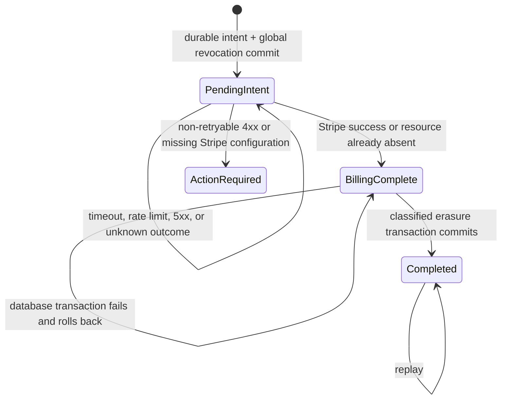

# Stage 4.3-E Global Revocation and Deletion Orchestration

Status date: 2026-09-15

Delivery issue: [#13](https://github.com/Esteve32/GreenElephantorg/issues/13)

Authority: DEC-041 and PRD AC-006

Branch: `feature/seed-mvp`

This record separates approved requirements, branch implementation, evidence,
and production work. It creates no authority to run a migration, contact Stripe,
deploy, merge to `main`, or begin Stage 4.3-F.

## Decision and state scaffold

The account state and durable request serve different purposes:

- `client_users.account_state = deletion_pending` denies account access while
  identifiers still exist for billing and classified erasure.
- `client_users.auth_version` binds every accepted session to a specific account
  version. Committing deletion rotates the version and deletes all session-store
  rows for the account in the same PostgreSQL transaction.
- `myfive_account_deletion_requests` survives deletion of `client_users`. It
  stores only the internal subject key, state, phase, attempt count, allowlisted
  error code, and timestamps. It stores no email or Stripe identifier.

External billing work never runs inside a PostgreSQL transaction. A Stripe
success is persisted as `billing_complete` before classified erasure begins. A
database retry at that phase skips Stripe. A repeated Stripe deletion that finds
the resource already absent counts as idempotent completion. Multiple workers
may race, so provider calls must remain safe under replay and the final database
transaction remains serialized by the subject advisory lock.

## Branch implementation map

| Requirement | Branch implementation | Current evidence state |
| :--- | :--- | :--- |
| Durable intent before Stripe | `beginMyFiveAccountDeletion` commits request, pending account, auth rotation, and session deletion together | CI run 24 passes the disposable PostgreSQL assertion |
| All sessions fail closed | MyFive and portal gates compare `clientAuthVersion`; password, Google, LinkedIn, reset, and `/me` paths require active account state | Direct middleware and static auth-path tests pass |
| Retryable Stripe boundary | Gateway classifies missing/404 as complete; timeout/connection/429/5xx as retry; other 4xx as action required | Pure outcome and PostgreSQL phase tests pass in CI run 24 |
| Database retry after Stripe | `billing_complete` commits before the classified erasure transaction; rollback writes a redacted retry state | Disposable PostgreSQL failure and resume fixture passes in CI run 24 |
| Webhook reorder | Checkout persistence is an atomic `INSERT … SELECT` from an active account; subscription updates require an active account | Static query-switch test passes; cross-stage journey remains for #14 |
| User status | Settings renders pending, completed, and action-required copy and wipes the current browser vault only after intent is accepted | Branch implementation inspected; browser journey remains for #14 |
| Redacted operations | Request ledger and worker logs exclude Stripe IDs, emails, tokens, card fields, and private payloads | Pure redaction assertions pass; final log audit remains for #14 |
| Safe rollout | `MYFIVE_RESUMABLE_DELETION_ENABLED` defaults disabled; disabled state rejects new requests; rollback must keep existing pending accounts locked | Migration plan and feature gate inspected; no production activation |

## Failure and recovery matrix

| Failure point | Durable result | Retry behavior | User-visible state |
| :--- | :--- | :--- | :--- |
| PostgreSQL fails before intent commit | Transaction rolls back; no request is accepted and existing sessions remain | User may submit again after recovery | `action_required`; response says deletion was not accepted |
| Session-store deletion fails inside intent transaction | Entire intent transaction rolls back | User may submit again after recovery | `action_required`; no completion claim |
| Stripe timeout, connection error, rate limit, or 5xx | Account stays pending; phase stays `intent_committed`; allowlisted code and next attempt are saved | Worker retries; duplicate provider work is tolerated | `pending` |
| Stripe resource is missing/already deleted | Billing phase becomes complete | Continue to database erasure | `pending` or `completed` in the same request |
| Stripe non-retryable 4xx or missing configuration | Account stays pending and signed out; request becomes `action_required` | Operator fixes configuration and explicitly requeues the same durable request | `action_required` |
| PostgreSQL fails after billing completion | Erasure transaction rolls back; `billing_complete` remains durable | Worker retries database phase and skips Stripe | `pending` |
| Delayed entitlement webhook | Atomic active-account predicate prevents insert/update | Stripe retry may be acknowledged without restoring application access | Account remains pending/completed |
| Completed request is replayed | Completed ledger row is returned | No Stripe or erasure work repeats | `completed` |

## Specified but not built or activated

- No production migration has been run and the feature flag is not enabled in
  any deployed environment.
- No live Stripe customer or subscription has been changed.
- No operator UI/API for requeuing `action_required` requests is built. Recovery
  is an accountable database operation until separately specified and approved.
- No user notification outside the in-request Settings response is built.
- No production backup-erasure replay, monitoring dashboard, alert routing, or
  service-level measurement is built.
- The complete cross-stage browser, administrator, log, concurrency, export,
  deletion, and recovery suite belongs to #14 and has not started.

## Evidence gate for #13

Before #13 can request human privacy/security approval, the PR branch must show:

1. TypeScript check and production build pass.
2. All repository tests pass.
3. The disposable PostgreSQL fixture proves pre-intent rollback, global session
   revocation, pending login denial, Stripe retry, missing billing, completed
   replay, database failure after billing, and action-required redaction.
4. CI evidence is linked from this document, issue #13, PR #4, and the Decision
   Log evidence index.
5. A human privacy/security approval is recorded separately. Approval of the
   implementation evidence still does not authorize production activation.

## Evidence chronology

- [CI run 23](https://github.com/Esteve32/GreenElephantorg/actions/runs/35002764470)
  passed dependency installation, TypeScript, and the production build. Its test
  step failed at Stage 4.3-E fixture setup with PostgreSQL `42601` because a
  parameterized call contained two statements. The state-machine assertion had
  not yet run. The fixture now sends those statements separately; the failed run
  remains part of the evidence trail.
- [CI run 24](https://github.com/Esteve32/GreenElephantorg/actions/runs/35003221437)
  passed dependency installation, TypeScript, all 31/31 tests against PostgreSQL
  16, and the production build. The automated PR evidence is recorded in
  [PR comment 5685166304](https://github.com/Esteve32/GreenElephantorg/pull/4#issuecomment-5685166304).

Engineering evidence items 1–4 are satisfied. Item 5, Estève's explicit human
privacy/security approval, was satisfied on 2026-09-15 after review of the
passing evidence. The approval completes the Stage 4.3-E branch gate only. It
does not authorize the production migration, feature-flag activation, a live
Stripe operation, deployment, merge to `main`, or Stage 4.3-F.
