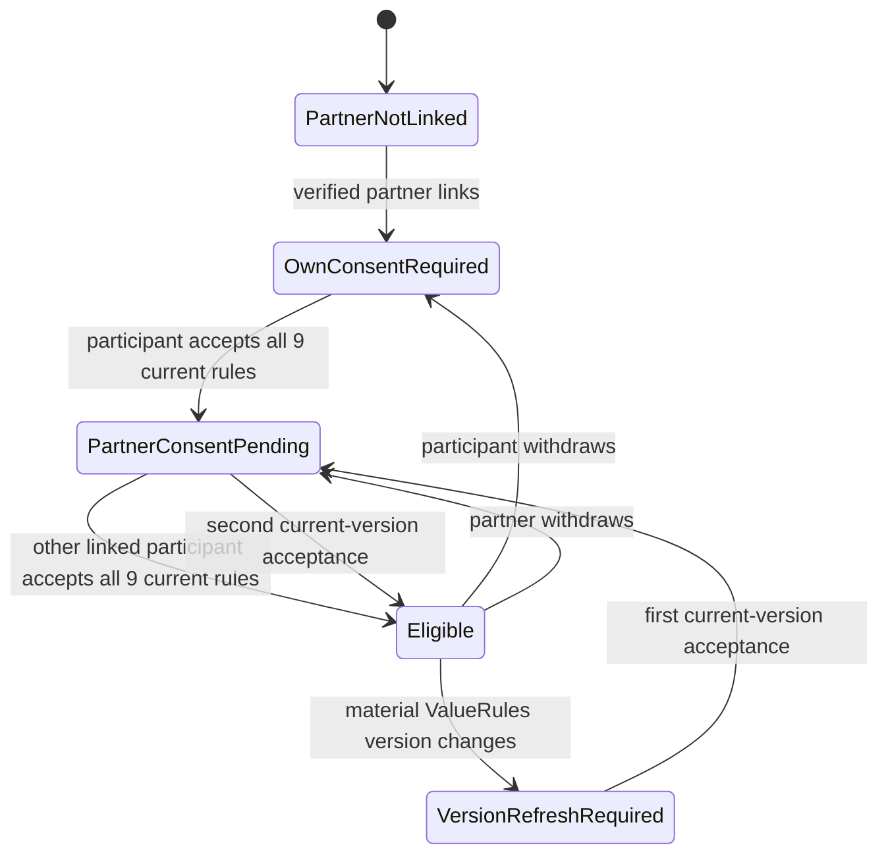

# Stage 4.3 Privacy Audit and Recovery Ledger

Status date: 2026-09-11  
Branch: `feature/seed-mvp`  
Pull request: [#4](https://github.com/Esteve32/GreenElephantorg/pull/4) (draft)  
Parent remediation issue: [#8](https://github.com/Esteve32/GreenElephantorg/issues/8)

This document is evidence, not a new product decision. `docs/DECISION_LOG.md`
remains the canonical approval record and `docs/PRD.md` remains the canonical
requirements record. GitHub issues define bounded delivery units. A checked
implementation item means its branch implementation is saved; it does not mean
that a planned migration was run, the feature was deployed, or Stage 4.3 received
final human approval.

## Recovery order

If work must resume without this chat history, reconstruct state in this order:

1. Read DEC-041 and the Stage 4 checklist in `docs/DECISION_LOG.md`.
2. Read the acceptance criteria and unchecked proof journey in `docs/PRD.md`.
3. Read issues #8 through #14 and their evidence comments.
4. Inspect draft PR #4 and the implementation-evidence index.
5. Treat every unchecked item and every row marked `Specified` as not yet built.
6. Never infer that a migration was run, a deployment occurred, or a human review
   was approved unless a separately attributable record says so.

## Stage status map

| Slice | Specification | Branch implementation | Direct evidence | Human gate |
| :--- | :--- | :--- | :--- | :--- |
| 4.3-A / #9 — browser-only check-ins and log boundary | Approved in DEC-041 | Saved | Targeted tests recorded | Slice complete; final cross-stage proof remains in 4.3-F |
| 4.3-B / #10 — account and privileged authorization | Approved in DEC-041 | Saved | Targeted tests recorded | Slice complete; final cross-stage proof remains in 4.3-F |
| 4.3-C / #11 — bilateral ValueRules consent | Approved in DEC-041 | Saved; audit amendments prepared | State, identity, version, withdrawal, denial, and lock-order tests | Awaiting Estève's review of this evidence |
| 4.3-D / #12 — ownership, export, and deletion | Approved in DEC-041 and specified in #12 | **Not built** | None | Implementation authorized only after #11 closes |
| 4.3-E / #13 — global session revocation and resumable Stripe deletion | Approved in DEC-041 and specified in #13 | **Not built** | None | Future separately bounded slice |
| 4.3-F / #14 — cross-stage privacy regression and approval | Approved in DEC-041 and specified in #14 | **Not built** | None | Final Stage 4.3 human privacy/security approval |

Parent Stage 4.3 remains incomplete. Production schema/data migration, deployment,
Stripe mutation, outbound email, DNS/infrastructure work, and merge to `main` are
not part of this audit.

## 4.3-C state model

Agreement creation and updates are permitted only in `Eligible`. Private product
use does not depend on this shared-agreement state.

## 4.3-C requirement trace

| #11 requirement | Implementation evidence | Test/evidence state |
| :--- | :--- | :--- |
| One receipt cannot satisfy both people | Gate resolves owner and partner by linked account ID and finds each receipt separately | Direct state test passes |
| Labels, emails, sessions, or replayed IDs cannot substitute for a participant | Gate accepts only the slot's `user_id` and `partner_user_id`; client receipt IDs are ignored | Direct identity and replay test passes |
| Missing, incomplete, withdrawn, or stale consent fails closed | Append-only event evaluation requires all nine rules, `accepted`, and the current material version | Direct negative-state tests pass |
| Denials contain no private payload | Dedicated denied-event insert contains actor/slot/participant references, reason, version, and timestamp only | Static contract test passes |
| Successful versions retain exact evidence | Agreement row stores both participant IDs, rules version, and both receipt IDs | Direct policy and static route tests pass |
| Concurrent consent/agreement requests serialize | Acceptance, withdrawal, and agreement write take the same slot advisory transaction lock; event timestamps are forced into a monotonic slot order | Serialized-order and route lock-discipline tests prepared |
| Old `value_rules_consented = 'true'` cannot become evidence | Existing rows remain historical, the schema default is removed, and the additive migration drops the database default | Migration/schema contract test prepared; migration not run |
| UI distinguishes consent states | UI displays own consent, partner pending, eligible, version refresh, unlinked, and non-participant states | Static implementation inspected; browser journey remains for 4.3-F |

## API contract reviewed

- `POST /api/myfive/consent` requires an active verified account, a valid active
  partner slot, the exact current version, and all nine distinct rule IDs. It
  appends an `accepted` event.
- `POST /api/myfive/consent/withdraw` requires an active verified account and
  appends a `withdrawn` event for the current version.
- `GET /api/myfive/agreements/:slotId` requires a linked participant and returns
  the latest append-only version plus a derived UI state.
- `POST /api/myfive/agreements` validates the expected version inside the shared
  slot lock, reevaluates both receipts from the database, appends a sanitized
  denial when blocked, and appends a new version when eligible.

The migration file is an additive, unexecuted plan. It preserves historical rows,
adds explicit participant/version/receipt fields and denial events, and removes
the unsafe default for future writes. No historical `true` value is promoted to
consent evidence.

## Audit findings

### Resolved in the audit amendment

1. Consent acceptance and withdrawal previously wrote outside the agreement
   transaction lock. A withdrawal could therefore commit while an agreement was
   evaluating an older receipt snapshot. All three mutations now share the same
   per-slot advisory lock and row lock.
2. The legacy schema still generated `value_rules_consented = 'true'`. The default
   is removed in both the Drizzle model and the unexecuted migration plan.
3. Transaction start timestamps can move backward relative to a lock waiter.
   Consent writes now use `clock_timestamp()` and a monotonic per-slot floor so
   event evaluation has a deterministic order.

### Explicitly pending outside #11

- #12 must replace slot-wide export/deletion authority with field-level author,
  participant, and shared-record rules.
- #13 must implement global session revocation and idempotent, resumable Stripe
  deletion orchestration.
- #14 must run the complete AC-002/003/006/016/017 suite, including disposable
  database concurrency, browser-vault, administrator, logging, export, deletion,
  session-revocation, and partial-failure paths.
- Raw database error objects are still passed to some MyFive error logs. The
  general response-body logger is already removed, but #14 must prove that
  database error details cannot serialize private/free-text row content.

## Review gate

The 4.3-C implementation may be marked complete and issue #11 closed only after:

- the amended branch commit passes tests, type-check, and production build in CI;
- the evidence is attached to #11; and
- Estève explicitly approves the #11 privacy/security evidence.

That approval closes only 4.3-C. It does not approve 4.3-D implementation choices
that require a new retention/legal decision, production migration, deployment, or
final Stage 4.3 completion.
