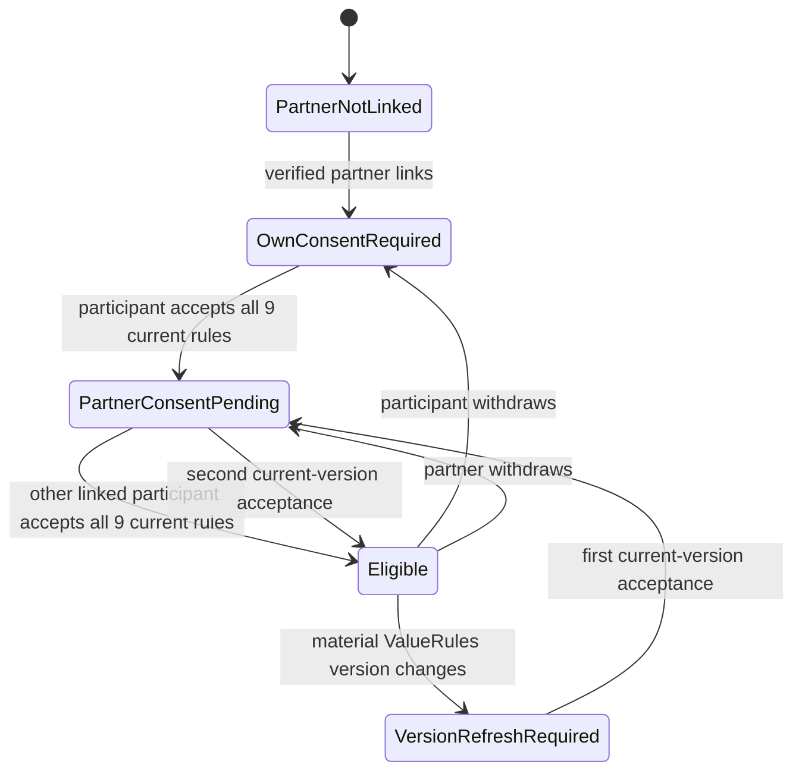

# Stage 4.3 Privacy Audit and Recovery Ledger

Status date: 2026-09-15
Branch: `feature/seed-mvp`  
Pull request: [#4](https://github.com/Esteve32/GreenElephantorg/pull/4) (draft)  
Parent remediation issue: [#8](https://github.com/Esteve32/GreenElephantorg/issues/8)

This document is evidence, not a new product decision. `docs/DECISION_LOG.md`
remains the canonical approval record and `docs/PRD.md` remains the canonical
requirements record. GitHub issues define bounded delivery units. A checked
implementation item means its branch implementation is saved; it does not mean
that a planned migration was run, the feature was deployed, or Stage 4.3 received
final human approval.

## Recovery order

If work must resume without this chat history, reconstruct state in this order:

1. Read DEC-041 and the Stage 4 checklist in `docs/DECISION_LOG.md`.
2. Read the acceptance criteria and unchecked proof journey in `docs/PRD.md`.
3. Read issues #8 through #14 and their evidence comments.
4. Inspect draft PR #4 and the implementation-evidence index.
5. Treat every unchecked item and every row marked `Specified` as not yet built.
6. Never infer that a migration was run, a deployment occurred, or a human review
   was approved unless a separately attributable record says so.

## Stage status map

| Slice | Specification | Branch implementation | Direct evidence | Human gate |
| :--- | :--- | :--- | :--- | :--- |
| 4.3-A / #9 — browser-only check-ins and log boundary | Approved in DEC-041 | Saved | Targeted tests recorded | Slice complete; final cross-stage proof remains in 4.3-F |
| 4.3-B / #10 — account and privileged authorization | Approved in DEC-041 | Saved | Targeted tests recorded | Slice complete; final cross-stage proof remains in 4.3-F |
| 4.3-C / #11 — bilateral ValueRules consent | Approved in DEC-041 | Saved at `3c52d20` and amended at `63202fe` | State, identity, version, withdrawal, denial, and lock-order tests; CI 18/18 | Approved by Estève on 2026-09-11 |
| 4.3-D / #12 — ownership, export, and deletion | DEC-041 plus Option C survivor custody approved by Estève | Saved on the PR branch for review at `b002365`, corrected at `fa2a497`, and recorded at `90d6548` | [CI run 20](https://github.com/Esteve32/GreenElephantorg/actions/runs/34993147065): 28/28 tests including disposable PostgreSQL, type-check, and production build; run 19 remains recorded as the failed typing discovery | Privacy/security evidence approved by Estève on 2026-09-15; production activation still requires qualified legal/privacy validation |
| 4.3-E / #13 — global session revocation and resumable Stripe deletion | Approved in DEC-041 and specified in #13 | Implementation candidate saved at `2970e7e`; fixture correction pending publication | Local compiler and 29/29 runnable tests pass; CI run 23 failed on parameterized multi-statement fixture setup before the Stage 4.3-E assertions, now corrected for rerun | Human privacy/security evidence approval pending |
| 4.3-F / #14 — cross-stage privacy regression and approval | Approved in DEC-041 and specified in #14 | **Not built** | None | Final Stage 4.3 human privacy/security approval |

Parent Stage 4.3 remains incomplete. Production schema/data migration, deployment,
Stripe mutation, outbound email, DNS/infrastructure work, and merge to `main` are
not part of this audit.

## 4.3-D implementation checkpoint

The field-level ownership, visibility, export, deletion, and retention analysis is
preserved in `docs/STAGE_4_3_D_OWNERSHIP_MATRIX_PROPOSAL.md`. Estève selected
Option C on 2026-09-11: after one account is deleted, the surviving participant
keeps read, export, and delete access to the frozen agreement until they delete
it or their own account. The selected policy, disclosure copy, rights handling,
and production legal gate are now recorded in DEC-041 and the PRD.

The branch implementation now adds explicit participant relations, active/frozen
lifecycle constraints, survivor-only read/export/delete capabilities, minimized
custody-event logging, symmetric account-deletion planning, provisional-data
expiry, cross-subject export minimization, and the two exact disclosures. The
additive migration is a proposal and has not been executed.

Approval of the product direction does not certify a lawful basis. Production
activation remains blocked until qualified privacy counsel or the accountable
DPO records the purpose, lawful basis, any Article 9 condition, rights-request
procedure, privacy notice, and backup-erasure process. Estève approved the final
#12 privacy/security implementation evidence on 2026-09-15. That approval does
not satisfy or waive the separate production legal/privacy gate. The current
workspace has no `DATABASE_URL` or disposable PostgreSQL runtime. A dedicated
local-only `myfive_test` fixture is now wired into the pull-request workflow.
[CI run 19](https://github.com/Esteve32/GreenElephantorg/actions/runs/34992688749)
executed it and failed closed before deletion because PostgreSQL could not infer
a reused subject-ID parameter consistently (`42P08`). The query now casts that
parameter explicitly; the database-fixture gate remains open until the corrected
CI run succeeds.

## 4.3-C state model

Agreement creation and updates are permitted only in `Eligible`. Private product
use does not depend on this shared-agreement state.

## 4.3-C requirement trace

| #11 requirement | Implementation evidence | Test/evidence state |
| :--- | :--- | :--- |
| One receipt cannot satisfy both people | Gate resolves owner and partner by linked account ID and finds each receipt separately | Direct state test passes |
| Labels, emails, sessions, or replayed IDs cannot substitute for a participant | Gate accepts only the slot's `user_id` and `partner_user_id`; client receipt IDs are ignored | Direct identity and replay test passes |
| Missing, incomplete, withdrawn, or stale consent fails closed | Append-only event evaluation requires all nine rules, `accepted`, and the current material version | Direct negative-state tests pass |
| Denials contain no private payload | Dedicated denied-event insert contains actor/slot/participant references, reason, version, and timestamp only | Static contract test passes |
| Successful versions retain exact evidence | Agreement row stores both participant IDs, rules version, and both receipt IDs | Direct policy and static route tests pass |
| Concurrent consent/agreement requests serialize | Acceptance, withdrawal, and agreement write take the same slot advisory transaction lock; event timestamps are forced into a monotonic slot order | Serialized-order and route lock-discipline tests prepared |
| Old `value_rules_consented = 'true'` cannot become evidence | Existing rows remain historical, the schema default is removed, and the additive migration drops the database default | Migration/schema contract test prepared; migration not run |
| UI distinguishes consent states | UI displays own consent, partner pending, eligible, version refresh, unlinked, and non-participant states | Static implementation inspected; browser journey remains for 4.3-F |

## API contract reviewed

- `POST /api/myfive/consent` requires an active verified account, a valid active
  partner slot, the exact current version, and all nine distinct rule IDs. It
  appends an `accepted` event.
- `POST /api/myfive/consent/withdraw` requires an active verified account and
  appends a `withdrawn` event for the current version.
- `GET /api/myfive/agreements/:slotId` requires a linked participant and returns
  the latest append-only version plus a derived UI state.
- `POST /api/myfive/agreements` validates the expected version inside the shared
  slot lock, reevaluates both receipts from the database, appends a sanitized
  denial when blocked, and appends a new version when eligible.

The migration file is an additive, unexecuted plan. It preserves historical rows,
adds explicit participant/version/receipt fields and denial events, and removes
the unsafe default for future writes. No historical `true` value is promoted to
consent evidence.

## Audit findings

### Resolved in the audit amendment

1. Consent acceptance and withdrawal previously wrote outside the agreement
   transaction lock. A withdrawal could therefore commit while an agreement was
   evaluating an older receipt snapshot. All three mutations now share the same
   per-slot advisory lock and row lock.
2. The legacy schema still generated `value_rules_consented = 'true'`. The default
   is removed in both the Drizzle model and the unexecuted migration plan.
3. Transaction start timestamps can move backward relative to a lock waiter.
   Consent writes now use `clock_timestamp()` and a monotonic per-slot floor so
   event evaluation has a deterministic order.

### Explicitly pending after the branch implementation

- #12 implementation evidence is approved and its Stage 4.3-D checklist item is
  complete. The qualified legal/privacy gate remains mandatory before any
  production activation of survivor custody.
- #13 now has an implementation candidate for global session revocation and
  idempotent, resumable Stripe deletion orchestration. Its dedicated disposable
  PostgreSQL fixture and branch CI must pass before evidence approval is requested.
- #14 must run the complete AC-002/003/006/016/017 suite, including disposable
  database concurrency, browser-vault, administrator, logging, export, deletion,
  session-revocation, and partial-failure paths.
- Raw database error objects are still passed to some MyFive error logs. The
  general response-body logger is already removed, but #14 must prove that
  database error details cannot serialize private/free-text row content.

## Review result

The 4.3-C review gate was satisfied on 2026-09-11:

- the amended branch commit passed 18/18 tests, type-check, and production build in CI;
- the evidence was attached to #11; and
- Estève explicitly approved the #11 privacy/security evidence in the workshop.

The 2026-09-11 approval closed only 4.3-C. At that time it did not approve the
4.3-D implementation or authorize a production migration, deployment, or final
Stage 4.3 completion. The later 4.3-D approval is recorded below.

The first 4.3-D branch implementation passed 26/26 repository tests,
`npm run check`, and `npm run build` on 2026-09-12. The evidence-hardening batch
passed all 27 locally runnable tests and `npm run check` on 2026-09-15; its 28th
test is the dedicated PostgreSQL fixture and correctly skips without
`TEST_DATABASE_URL`. [CI run 20](https://github.com/Esteve32/GreenElephantorg/actions/runs/34993147065)
then passed all 28/28 tests against PostgreSQL 16 together with `npm run check`
and `npm run build`. The database-fixture gate is satisfied. Qualified
production legal/privacy validation remains open.

Estève explicitly approved the final #12 privacy/security evidence on
2026-09-15. This completes the Stage 4.3-D branch implementation gate. It does
not authorize the production migration, deployment, or survivor-custody
activation. Estève separately authorized starting Stage 4.3-E on 2026-09-15;
that authorization is not approval of its implementation evidence and does not
authorize Stage 4.3-F.
